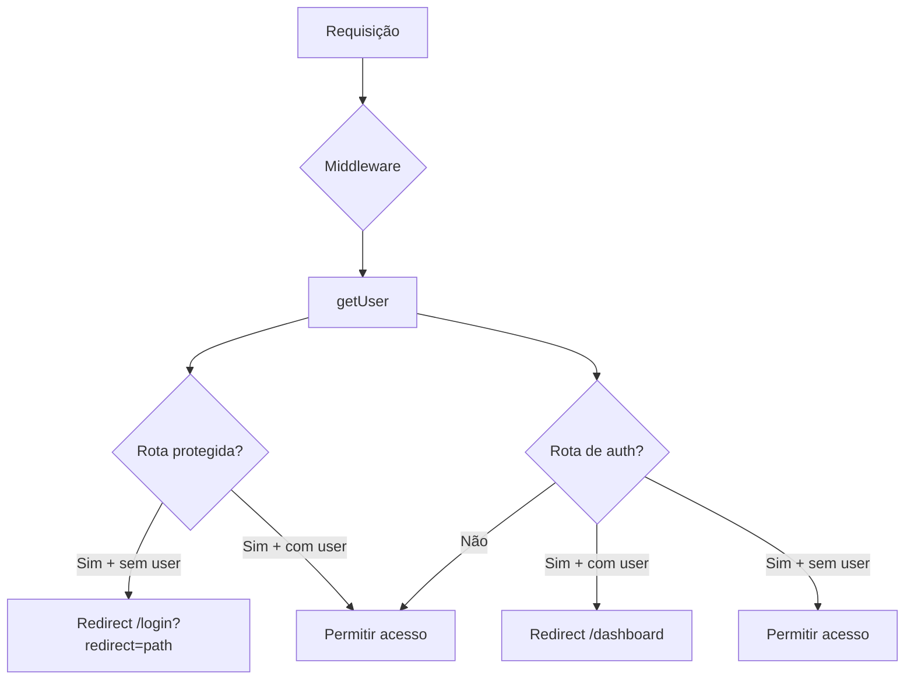

<!-- generated-by: gsd-doc-writer -->
# Arquitetura do Sistema — SGI Master

## Visão Geral

O **SGI Master** (Sistema de Gestão Integrada) é uma aplicação web SaaS multi-tenant desenvolvida para igrejas e ministérios brasileiros. Construída com **Next.js 15**, **React 19** e **Supabase**, a arquitetura segue o padrão **monolito moderno** com frontend e backend coesos, utilizando o App Router do Next.js para renderização híbrida (server/client components) e o Supabase como backend completo (PostgreSQL, Autenticação, Storage, RLS).

A aplicação opera exclusivamente no lado do cliente para as páginas do dashboard (`'use client'`), com o middleware atuando como guardião de autenticação. O isolamento multi-tenant é implementado via `church_id` em todas as tabelas do banco de dados, combinado com **Row Level Security (RLS)** do PostgreSQL, garantindo que cada igreja veja apenas seus próprios dados.

---

## Estrutura de Diretórios

```
siltec-sgi/
├── src/
│   ├── app/                          # Next.js App Router
│   │   ├── (auth)/                   # Grupo de rotas de autenticação
│   │   │   ├── layout.tsx            # Layout vazio (provider já no root)
│   │   │   ├── login/page.tsx        # Página de login (React Hook Form + Zod)
│   │   │   ├── register/page.tsx     # Cadastro de novo usuário
│   │   │   └── forgot-password/      # Recuperação de senha
│   │   ├── (dashboard)/              # Grupo de rotas protegidas
│   │   │   ├── layout.tsx            # Layout com Sidebar + TopBar + guard
│   │   │   ├── dashboard/page.tsx    # Dashboard com KPIs, gráficos, calendário
│   │   │   └── membros/
│   │   │       ├── page.tsx          # Listagem de membros com busca/filtros
│   │   │       ├── novo/page.tsx     # Cadastro de novo membro
│   │   │       └── [id]/
│   │   │           ├── page.tsx      # Perfil do membro com timeline
│   │   │           └── editar/       # Edição de membro
│   │   ├── layout.tsx                # Root layout (providers + fonts + CSS)
│   │   ├── page.tsx                  # Redirect para /login
│   │   └── globals.css              # CSS custom properties + utilitários
│   ├── components/
│   │   ├── layout/
│   │   │   ├── Sidebar.tsx           # Navegação lateral fixa (w-72)
│   │   │   └── TopBar.tsx            # Barra superior com busca global
│   │   ├── ui/
│   │   │   ├── Card.tsx              # Componente Card com suporte a header
│   │   │   └── Badge.tsx             # Badge com variantes (primary, secondary, etc.)
│   │   ├── DashboardProvider.tsx     # Provider de proteção do dashboard
│   │   └── ErrorBoundary.tsx         # Error boundary com fallback UI
│   ├── hooks/
│   │   ├── useAuth.tsx               # Contexto de autenticação + provider
│   │   └── api/
│   │       ├── useMembers.ts         # Hook de listagem com debounce e paginação
│   │       ├── useMember.ts          # Hook de membro individual com joins
│   │       ├── useMembersQuery.ts    # Hooks React Query (CRUD completo)
│   │       └── useFamilyGroups.ts    # Hook de grupos familiares
│   ├── lib/
│   │   ├── supabase.ts              # Cliente Supabase (createBrowserClient)
│   │   └── errors.ts                # Hierarquia de erros + handlers
│   ├── providers/
│   │   └── QueryProvider.tsx         # TanStack React Query (5min stale, 10min cache)
│   ├── types/
│   │   ├── member.ts                # Interfaces: Member, FamilyGroup, Timeline, etc.
│   │   └── memberSchema.ts          # Schema Zod para formulários de membro
│   └── middleware.ts                 # Guard de autenticação (proteção de rotas)
├── supabase/migrations/             # 15 migrações SQL versionadas
├── tailwind.config.ts               # Tema escuro MD3 (35+ cores customizadas)
├── vitest.config.ts                  # Vitest com jsdom, alias @/src
├── next.config.ts                    # Imagens permitidas de *.supabase.co
├── postcss.config.mjs                # Tailwind + Autoprefixer
└── tsconfig.json                     # Strict mode, path alias @/
```

---

## Arquitetura de Componentes

### Diagrama de Provedores (Provider Tree)

A árvore de provedores é definida em `src/app/layout.tsx` e segue esta hierarquia:

```
<html lang="pt-BR" className="dark">
  <body>
    <ErrorBoundary>              ← Captura erros não tratados em toda a árvore
      <QueryProvider>            ← TanStack React Query (cache + mutations)
        <AuthProvider>           ← Contexto de autenticação (user, session, signIn, etc.)
          {children}             ← Páginas (auth) ou (dashboard)
        </AuthProvider>
      </QueryProvider>
    </ErrorBoundary>
  </body>
</html>
```

### Layout do Dashboard

O layout protegido em `src/app/(dashboard)/layout.tsx` renderiza:

```
┌──────────────────────────────────────────────────────────────┐
│ Sidebar (w-72 = 288px)   │  TopBar (h-20 = 80px)            │
│  ┌─────────────────┐     │ ┌──────────────────────────────┐ │
│  │ SGI Master       │     │ │ [🔍 Buscar...]  🔔 ❓ 👤  │ │
│  │ Gestão Eclesiástica│    │ └──────────────────────────────┘ │
│  ├─────────────────┤     │────────────────────────────────── │
│  │ 📊 Dashboard    │     │                                   │
│  │ 👥 Membros      │     │  children                         │
│  │ 💰 Financeiro   │     │  (conteúdo da página ativa)       │
│  │ 📅 Eventos      │     │                                   │
│  │ ⛪ Ministérios  │     │                                   │
│  │ 📈 Relatórios   │     │                                   │
│  │ ⚙ Configurações│     │                                   │
│  ├─────────────────┤     │                                   │
│  │ [Novo Registro] │     │                                   │
│  │ 🚪 Sair        │     │                                   │
│  └─────────────────┘     │                                   │
└──────────────────────────────────────────────────────────────┘
```

**Funcionalidades do layout do dashboard:**
- **Verificação de autenticação**: exibe spinner (`Loader2`) enquanto carrega, redireciona para `/login` se não houver usuário
- **Sidebar**: fixa à esquerda (`fixed left-0`), 288px de largura, glassmorphism com `blur(24px)`
- **TopBar**: fixa no topo (`sticky top-0`), 80px de altura, campo de busca global, notificações, ajuda e perfil
- **Conteúdo**: margem `ml-72` para respeitar a sidebar, padding `p-margin` (40px)
- **ErrorBoundary**: envolve o conteúdo para capturar erros em páginas específicas

### NavItems do Sidebar

| Ícone | Rota | Descrição |
|-------|------|-----------|
| `dashboard` | `/dashboard` | KPIs, gráficos, calendário, atividades |
| `group` | `/membros` | Listagem, cadastro, perfil e edição |
| `payments` | `/financeiro` | Gestão financeira (dízimos, ofertas) |
| `event` | `/eventos` | Agenda e calendário de eventos |
| `church` | `/ministerios` | Departamentos e ministérios |
| `assessment` | `/relatorios` | Relatórios gerenciais |
| `settings` | `/configuracoes` | Configurações do sistema |

---

## Fluxo de Autenticação

### Middleware (`src/middleware.ts`)

O middleware do Next.js é o guardião de autenticação. Executa em todas as requisições exceto arquivos estáticos:

1. Cria um cliente Supabase server-side via `createServerClient` com gerenciamento de cookies
2. Chama `supabase.auth.getUser()` para obter a sessão atual
3. Verifica a rota acessada:
   - **Rota protegida** (`/dashboard/*`) sem usuário → redireciona para `/login?redirect=<path>`
   - **Rota de auth** (`/login`, `/register`, `/forgot-password`, `/reset-password`) com usuário logado → redireciona para `/dashboard`
4. Retorna a resposta com cookies atualizados



### Hook useAuth (`src/hooks/useAuth.tsx`)

Provider de contexto que expõe:

| Método | Descrição |
|--------|-----------|
| `user` | Objeto `User` do Supabase ou `null` |
| `session` | Sessão atual |
| `loading` | Estado de carregamento inicial |
| `signIn(email, password)` | Login com email e senha |
| `signUp(email, password, name)` | Cadastro com metadados de nome |
| `signOut()` | Logout e limpeza de estado |
| `resetPassword(email)` | Envio de email de recuperação |
| `updatePassword(newPassword)` | Atualização de senha |

**Fluxo de inicialização:**
1. Registra listener `onAuthStateChange` antes de buscar a sessão (evita race conditions)
2. Busca sessão atual via `getSession()`
3. Atualiza estado `user` e `session` conforme respostas
4. Limpeza: componente desmontado ignora atualizações (`mounted` flag)

---

## Arquitetura do Banco de Dados

### Diagrama Entidade-Relacionamento

```
┌───────────────┐       ┌──────────────────┐       ┌──────────────────┐
│   members     │       │  family_members  │       │  family_groups   │
│───────────────│       │──────────────────│       │──────────────────│
│ id (PK)       │──┐    │ id (PK)          │       │ id (PK)          │
│ church_id     │  │    │ church_id        │──┐    │ church_id        │
│ name          │  │    │ family_group_id  │  │    │ name             │
│ birth_date    │  │    │ member_id (FK)───┘──┘───>│ leader_id (FK)   │
│ gender        │  │    │ relationship     │       │ description      │
│ marital_status│  │    │ is_primary_contact│      │ status           │
│ phone         │  │    │ created_at       │       │ created_at       │
│ email         │  │    │ updated_at       │       │ updated_at       │
│ address       │  │    │ deleted_at       │       │ deleted_at       │
│ baptism_date  │  │    └──────────────────┘       └──────────────────┘
│ conversion_date│ │
│ department_id │  │    ┌──────────────────┐       ┌──────────────────┐
│ status        │  │    │  member_roles    │       │ member_timeline  │
│ avatar_url    │  │    │──────────────────│       │──────────────────│
│ created_at    │  │    │ id (PK)          │       │ id (PK)          │
│ updated_at    │  ├───>│ church_id        │       │ church_id        │
│ deleted_at    │  │    │ member_id (FK)   │       │ member_id (FK)───┘
│ created_by    │  │    │ role (enum)      │       │ event_type (enum)
│ updated_by    │  │    │ department_id    │       │ old_value        │
└───────────────┘  │    │ is_active        │       │ new_value        │
                   │    │ start_date       │       │ description      │
                   │    │ end_date         │       │ effective_date   │
                   │    │ granted_by       │       │ created_by       │
                   │    │ created_at       │       │ created_at       │
                   │    │ updated_at       │       │ updated_at       │
                   │    │ deleted_at       │       │ deleted_at       │
                   │    └──────────────────┘       └──────────────────┘
                   │
                   │    ┌──────────────────┐       ┌──────────────────┐
                   │    │member_attendances│       │     events       │
                   │    │──────────────────│       │──────────────────│
                   └───>│ id (PK)          │       │ id (PK)          │
                        │ church_id        │       │ church_id        │
                        │ member_id (FK)───┘──┐   │ title            │
                        │ event_id (FK)───┐──┘───>│ description      │
                        │ status (enum)   │       │ event_type       │
                        │ check_in_time   │       │ start_date       │
                        │ check_out_time  │       │ end_date         │
                        │ notes           │       │ location         │
                        │ justification   │       │ is_online        │
                        │ recorded_by     │       │ capacity         │
                        │ created_at      │       │ status           │
                        │ updated_at      │       │ department_id    │
                        │ deleted_at      │       │ created_by       │
                        └──────────────────┘       └──────────────────┘
```

### Tabelas

#### profiles

Tabela de perfis de usuário vinculada ao `auth.users` do Supabase. Criada via trigger automático.

| Coluna | Tipo | Descrição |
|--------|------|-----------|
| `id` | `UUID PK` | Referência a `auth.users.id` com `ON DELETE CASCADE` |
| `email` | `TEXT` | Email do usuário |
| `name` | `TEXT` | Nome completo |
| `role` | `TEXT` | Papel RBAC (default: `member`) |
| `status` | `BOOLEAN` | Ativo/inativo (default: `true`) |
| `created_at` | `TIMESTAMPTZ` | Data de criação |

**Trigger**: `on_auth_user_created` — insere automaticamente um perfil quando um novo usuário é registrado.

#### members

Tabela central do sistema com informações pessoais e ministeriais.

| Coluna | Tipo | Descrição |
|--------|------|-----------|
| `id` | `UUID PK` | `uuid_generate_v4()` |
| `church_id` | `UUID NOT NULL` | Identificador multi-tenant |
| `name` | `VARCHAR(255) NOT NULL` | Nome completo |
| `birth_date` | `DATE` | Data de nascimento |
| `gender` | `gender_type` | Enum: `male`, `female`, `other`, `prefer_not_to_say` |
| `marital_status` | `marital_status_type` | Enum: `single`, `married`, `divorced`, `widowed`, `separated` |
| `phone` | `VARCHAR(20)` | Telefone para contato |
| `email` | `VARCHAR(255)` | Email |
| `address` | `TEXT` | Endereço completo |
| `address_city` | `VARCHAR(100)` | Cidade |
| `address_state` | `VARCHAR(50)` | Estado |
| `baptism_date` | `DATE` | Data de batismo |
| `conversion_date` | `DATE` | Data de conversão |
| `department_id` | `UUID` | Departamento/ministério principal |
| `status` | `BOOLEAN` | Ativo (`true`) ou inativo (`false`) |
| `avatar_url` | `TEXT` | URL da foto |
| `created_at` | `TIMESTAMPTZ` | `DEFAULT NOW()` |
| `updated_at` | `TIMESTAMPTZ` | Atualizado por trigger |
| `deleted_at` | `TIMESTAMPTZ` | Soft delete (`NULL` = ativo) |
| `created_by` | `UUID` | Usuário que criou |
| `updated_by` | `UUID` | Usuário que atualizou |

**Índices**: `church_id`, `(church_id, status)` com filtro `deleted_at IS NULL`, `department_id`, `(church_id)` com filtro `deleted_at IS NULL`.

#### family_groups

Grupos familiares ou unidades domésticas dentro da igreja.

| Coluna | Tipo | Descrição |
|--------|------|-----------|
| `id` | `UUID PK` | |
| `church_id` | `UUID NOT NULL` | Multi-tenant |
| `name` | `VARCHAR(255) NOT NULL` | Nome do grupo |
| `leader_id` | `UUID FK → members.id` | Líder do grupo (`ON DELETE SET NULL`) |
| `description` | `TEXT` | Descrição opcional |
| `status` | `BOOLEAN` | Ativo/inativo |

#### family_members

Tabela de junção N:N entre membros e grupos familiares.

| Coluna | Tipo | Descrição |
|--------|------|-----------|
| `id` | `UUID PK` | |
| `church_id` | `UUID NOT NULL` | Multi-tenant |
| `family_group_id` | `UUID FK → family_groups.id` | Grupo familiar (`ON DELETE CASCADE`) |
| `member_id` | `UUID FK → members.id` | Membro (`ON DELETE CASCADE`) |
| `relationship` | `family_relationship_type` | Enum com 22 tipos de relacionamento |
| `is_primary_contact` | `BOOLEAN` | Apenas 1 por grupo (índice único com filtro) |
| `notes` | `TEXT` | Observações |

**Tipos de relacionamento**: `husband`, `wife`, `son`, `daughter`, `father`, `mother`, `brother`, `sister`, `grandfather`, `grandmother`, `grandson`, `granddaughter`, `uncle`, `aunt`, `nephew`, `niece`, `cousin`, `father_in_law`, `mother_in_law`, `brother_in_law`, `sister_in_law`, `son_in_law`, `daughter_in_law`, `stepfather`, `stepmother`, `stepson`, `stepdaughter`, `other`.

#### member_timeline

Linha do tempo ministerial do membro. Registra mudanças de cargo, departamento, status e observações.

| Coluna | Tipo | Descrição |
|--------|------|-----------|
| `id` | `UUID PK` | |
| `church_id` | `UUID NOT NULL` | Multi-tenant |
| `member_id` | `UUID FK → members.id` | Membro (`ON DELETE CASCADE`) |
| `event_type` | `timeline_event_type` | `role_change`, `department_change`, `status_change`, `observation` |
| `old_value` | `TEXT` | Valor anterior |
| `new_value` | `TEXT` | Novo valor |
| `description` | `TEXT` | Descrição do evento |
| `effective_date` | `DATE` | Data de vigência |
| `created_by` | `UUID` | |

**Índice composto**: `(member_id, effective_date DESC)` para consultas de histórico.

#### member_roles

Histórico de atribuições de papéis RBAC com períodos de validade.

| Coluna | Tipo | Descrição |
|--------|------|-----------|
| `id` | `UUID PK` | |
| `church_id` | `UUID NOT NULL` | Multi-tenant |
| `member_id` | `UUID FK → members.id` | Membro |
| `role` | `member_role_type` | Enum com 5 níveis |
| `department_id` | `UUID` | Departamento associado |
| `is_active` | `BOOLEAN` | Se está ativo (índice com filtro) |
| `start_date` | `DATE NOT NULL` | Início da vigência |
| `end_date` | `DATE` | Fim da vigência |
| `granted_by` | `UUID` | Quem concedeu |
| `granted_at` | `TIMESTAMPTZ` | Quando foi concedido |
| `revoked_at` | `TIMESTAMPTZ` | Quando foi revogado |
| `revocation_reason` | `TEXT` | Motivo da revogação |

**Restrição**: `UNIQUE(member_id, role, is_active, start_date)`.

#### member_attendances

Registro de presença de membros em eventos.

| Coluna | Tipo | Descrição |
|--------|------|-----------|
| `id` | `UUID PK` | |
| `church_id` | `UUID NOT NULL` | Multi-tenant |
| `member_id` | `UUID FK → members.id` | Membro |
| `event_id` | `UUID FK → events.id` | Evento (nullable) |
| `status` | `attendance_status_type` | `present`, `absent`, `justified` |
| `check_in_time` | `TIMESTAMPTZ` | Check-in |
| `check_out_time` | `TIMESTAMPTZ` | Check-out |
| `notes` | `TEXT` | Observações |
| `justification` | `TEXT` | Justificativa de ausência |

**Restrição**: `UNIQUE(member_id, event_id)`.

#### events

Eventos gerenciados pela igreja (cultos, reuniões, celebrações).

| Coluna | Tipo | Descrição |
|--------|------|-----------|
| `id` | `UUID PK` | |
| `church_id` | `UUID NOT NULL` | Multi-tenant |
| `title` | `VARCHAR(255) NOT NULL` | Título do evento |
| `description` | `TEXT` | Descrição |
| `event_type` | `VARCHAR(50)` | Tipo: `culto`, `reunião`, `evento`, etc. |
| `start_date` | `TIMESTAMPTZ NOT NULL` | Início |
| `end_date` | `TIMESTAMPTZ` | Término |
| `location` | `VARCHAR(255)` | Local |
| `is_online` | `BOOLEAN` | Evento online |
| `online_link` | `TEXT` | Link do evento online |
| `capacity` | `INTEGER` | Capacidade máxima |
| `registered_count` | `INTEGER` | Inscritos |
| `department_id` | `UUID` | Departamento organizador |
| `status` | `VARCHAR(20)` | `scheduled`, `ongoing`, `completed`, `cancelled` |

### Enums do Banco

| Enum | Valores |
|------|---------|
| `gender_type` | `male`, `female`, `other`, `prefer_not_to_say` |
| `marital_status_type` | `single`, `married`, `divorced`, `widowed`, `separated` |
| `member_role_type` | `member`, `leader`, `treasurer`, `admin`, `super_admin` |
| `timeline_event_type` | `role_change`, `department_change`, `status_change`, `observation` |
| `attendance_status_type` | `present`, `absent`, `justified` |
| `family_relationship_type` | `husband`, `wife`, `son`, `daughter`, ..., `other` (22 valores) |

---

## Multi-tenancy e RLS

### Estratégia

O isolamento multi-tenant é implementado via **discriminator column**: toda tabela possui uma coluna `church_id` (UUID), e as políticas RLS garantem que cada requisição veja apenas dados da igreja do usuário autenticado.

### Função de Contexto

```
get_current_church_id()
```

A função obtém o `church_id` da sessão em três níveis de fallback:

1. `app.church_id` (configuração local da aplicação)
2. `request.jwt.claims.church_id` (claim direto no JWT)
3. `request.jwt.claims.user_metadata.church_id` (metadados do usuário)

### Políticas RLS

Cada tabela possui 4 políticas (SELECT, INSERT, UPDATE, DELETE) que verificam:

```sql
church_id = get_current_church_id()
```

Tabelas protegidas por RLS: `members`, `family_groups`, `family_members`, `member_timeline`, `member_roles`, `member_attendances`, `events`, `profiles`.

### Triggers Automáticos

Três triggers por tabela garantem integridade dos dados:

1. **`update_updated_at_column`** — Atualiza `updated_at` automaticamente em todo UPDATE
2. **`set_audit_columns`** — Define `created_by`/`updated_by` a partir do usuário da sessão
3. **`set_church_id_default`** — Preenche `church_id` automaticamente em INSERT

**Soft delete**: Tabelas como `members`, `family_groups`, `member_timeline`, `member_roles`, `member_attendances` e `events` possuem coluna `deleted_at`. Registros com `deleted_at IS NOT NULL` são considerados excluídos.

---

## Sistema RBAC

O sistema define 5 níveis hierárquicos de acesso (`member_role_type`):

| Role | Nível | Descrição |
|------|-------|-----------|
| `member` | 1 | Membro comum — acesso a dados pessoais e visão básica |
| `leader` | 2 | Líder de ministério/grupo — gestão de membros do seu grupo |
| `treasurer` | 3 | Tesoureiro — acesso ao módulo financeiro e relatórios |
| `admin` | 4 | Administrador — gestão completa da igreja |
| `super_admin` | 5 | Super administrador — acesso entre igrejas (multi-tenant) |

As roles são armazenadas com histórico temporal na tabela `member_roles`, permitindo:
- Atribuição de múltiplas roles com períodos de validade
- Auditoria de quem concedeu/revogou cada role
- Role ativa identificada por `is_active = true`

---

## Sistema de Design

### Tema Escuro (Dark Mode)

O sistema opera exclusivamente em **dark mode** (classe `dark` no `<html>`), com cores baseadas no **Material Design 3**.

#### CSS Custom Properties (`globals.css`)

Mais de 50 variáveis CSS definidas no `:root`:

| Categoria | Exemplo | Valor HSL |
|-----------|---------|-----------|
| Background | `--background` | `222 47% 5%` |
| Primary | `--primary` | `262 83% 75%` (roxo claro) |
| Secondary | `--secondary` | `221 83% 82%` (azul claro) |
| Tertiary | `--tertiary` | `269 76% 80%` (rosa claro) |
| Error | `--error` | `5 85% 84%` (vermelho claro) |
| Superfície mais baixa | `--surface-container-lowest` | `222 59% 4%` |
| Superfície mais alta | `--surface-container-highest` | `222 32% 22%` |
| Texto primário | `--on-surface` | `220 20% 92%` |

#### Glassmorphism

Quatro utilitários CSS criam efeitos de profundidade:

| Classe | Background | Blur | Borda |
|--------|-----------|------|-------|
| `.glass` | `rgba(30, 41, 59, 0.4)` | `12px` | `1px solid rgba(255,255,255,0.1)` |
| `.glass-card` | `rgba(30, 41, 59, 0.4)` | `12px` | `1px solid rgba(255,255,255,0.1)` |
| `.glass-sidebar` | `rgba(23, 31, 51, 0.7)` | `24px` | `1px solid rgba(73,68,84,0.2)` |
| `.glass-topbar` | `rgba(11, 19, 38, 0.4)` | `12px` | — |

#### Tipografia

- **Fonte**: Manrope (Google Fonts), carregada via `@next/font` no layout
- **Classes de texto**: `font-h1` (32px/700), `font-h2` (24px/600), `font-h3` (20px/600), `font-body-lg` (16px/400), `font-body-md` (14px/400), `font-label-sm` (12px/600/uppercase)
- **Ícones**: Material Symbols Outlined com `font-variation-settings: 'FILL' 0, 'wght' 400, 'GRAD' 0, 'opsz' 24`

### Configuração Tailwind

O `tailwind.config.ts` estende o tema com:

- **35+ cores** mapeadas para variáveis CSS (primary, secondary, tertiary, surface, error, etc.)
- **Espaçamentos customizados**: `margin` (40px), `gutter` (24px), `unit` (4px), `xs` a `xl`
- **Fontes**: Manrope como sans-serif padrão
- **Tamanhos de fonte**: definidos com line-height e letter-spacing específicos

---

## Hooks e Camada de Dados

### Hooks Customizados

#### useAuth (Contexto global)

Provider no root layout que gerencia todo o ciclo de autenticação. Utiliza `onAuthStateChange` do Supabase para reatividade.

#### useMembers (API Layer — gerenciamento de estado local)

Hook de listagem com debounce de 400ms, paginação, filtros (status, departamento, role) e busca por nome (`ilike`). Utiliza `useRef` para controle de montagem e debounce.

#### useMembersQuery (API Layer — React Query)

Conjunto de hooks baseados no TanStack React Query:

| Hook | Operação | Invalidação |
|------|----------|-------------|
| `useMembers` | Listagem com filtros | — |
| `useMember(id)` | Membro individual com joins | — |
| `useCreateMember` | Inserção | `['members']` |
| `useUpdateMember` | Atualização | `['members']` + `['member', id]` |
| `useDeleteMember` | Soft delete | `['members']` |

Configuração do QueryClient: `staleTime: 5min`, `gcTime: 10min`, `retry: 1`, `refetchOnWindowFocus: true`.

#### useMember (individual)

Busca membro com joins relacionais:
- `member_roles` (role, is_active)
- `member_timeline` (histórico completo)
- `family_members` com `family_groups` aninhado

#### useFamilyGroups

CRUD de grupos familiares com ordenação alfabética e inserção otimista.

### Camada de Erros (`src/lib/errors.ts`)

Hierarquia de erros customizada:

```
Error
 └── AppError (message, code, statusCode)
      ├── AuthenticationError (401)
      ├── AuthorizationError (403)
      ├── ValidationError (400)
      ├── NotFoundError (404)
      └── DatabaseError (500)
```

Funções utilitárias:
- `handleSupabaseError(error)` — Mapeia erros do Supabase para a hierarquia
- `getErrorMessage(error)` — Extrai mensagem legível para o usuário
- `logError(error, context?)` — Log em desenvolvimento (preparado para Sentry)

---

## Testes

| Camada | Ferramenta | Localização |
|--------|-----------|-------------|
| Unitários | Vitest + jsdom | `src/__tests__/` |
| Integração | Vitest | `src/__integration__/` |
| E2E | Playwright | `src/__e2e__/` |

**Setup**: `@testing-library/jest-dom` com limpeza automática após cada teste.

**Configuração Vitest**: ambiente `jsdom`, aliases `@/` → `./src`, coverage provider `v8`.

---

## Fluxo de Dados — Exemplo Completo

### Requisição: Listar Membros

```
Usuário na página /membros
  │
  ├── middleware.ts valida sessão → OK (usuário autenticado)
  │
  ├── DashboardLayout.tsx
  │   ├── useAuth() verifica user/session
  │   ├── Renderiza Sidebar + TopBar
  │   └── Renderiza MembersPage em children
  │
  ├── MembersPage.tsx (client component)
  │   ├── useState: search, statusFilter, page
  │   ├── useMembers({ search, status, page }) — hook React Query
  │   │   ├── QueryKey: ['members', { search, status, departmentId, role, page, pageSize }]
  │   │   ├── supabase.from('members').select('*, member_roles(role, is_active)')
  │   │   │   .is('deleted_at', null)
  │   │   │   .ilike('name', '%termo%')  ← se search não vazio
  │   │   │   .eq('status', true/false)  ← se filtro ativo
  │   │   │   .order('name')
  │   │   │   .range(from, to)
  │   │   └── Retorna { members, total } com count='exact'
  │   │
  │   └── Renderiza tabela com dados + paginação
  │
  └── RLS: PostgreSQL filtra por church_id = get_current_church_id()
      └── Retorna apenas membros da igreja do usuário
```

---

## Decisões Arquiteturais

| Decisão | Justificativa |
|---------|---------------|
| Next.js 15 App Router | Rotas baseadas em sistema de arquivos, server/client components, layout aninhado |
| React 19 | Última versão estável com melhorias de concorrência e hooks |
| Supabase Auth + RLS | Multi-tenancy nativo sem necessidade de serviço adicional de autenticação |
| church_id em todas as tabelas | Padrão discriminator column — simples, performático e auditável |
| Soft delete | Preservação de dados históricos, recuperação de registros |
| Glassmorphism escuro | Identidade visual premium e moderna para gestão eclesiástica |
| TanStack React Query | Cache inteligente, deduplicação de requisições, mutations otimistas |
| Zod + React Hook Form | Validação tipada com TypeScript, formulários performáticos |
| Material Symbols | Biblioteca de ícones variável e consistente com o tema |
| Cliente Supabase browser | `createBrowserClient` do `@supabase/ssr` — compatível com middleware de cookies |

---

## Dependências Principais

| Pacote | Versão | Finalidade |
|--------|--------|------------|
| `next` | ^15.1.0 | Framework React com App Router |
| `react` | ^19.0.0 | Biblioteca de interface |
| `@supabase/supabase-js` | ^2.47.0 | Cliente Supabase |
| `@supabase/ssr` | ^0.5.2 | Suporte SSR com cookies |
| `@tanstack/react-query` | ^5.100.9 | Gerenciamento de estado server-side |
| `@tanstack/react-table` | ^8.21.3 | Tabela de dados headless |
| `react-hook-form` | ^7.54.0 | Formulários performáticos |
| `zod` | ^3.24.0 | Validação de esquemas TypeScript |
| `recharts` | ^2.15.0 | Gráficos e visualizações |
| `date-fns` | ^4.1.0 | Manipulação de datas |
| `lucide-react` | ^0.469.0 | Ícones adicionais |
| `class-variance-authority` | ^0.7.1 | Variantes de componentes |
| `tailwindcss` | ^3.4.17 | CSS utility-first |
| `vitest` | ^4.1.5 | Test runner |
| `@playwright/test` | ^1.59.1 | Testes E2E |
| `typescript` | ^5.7.0 | Type checking estrito |
